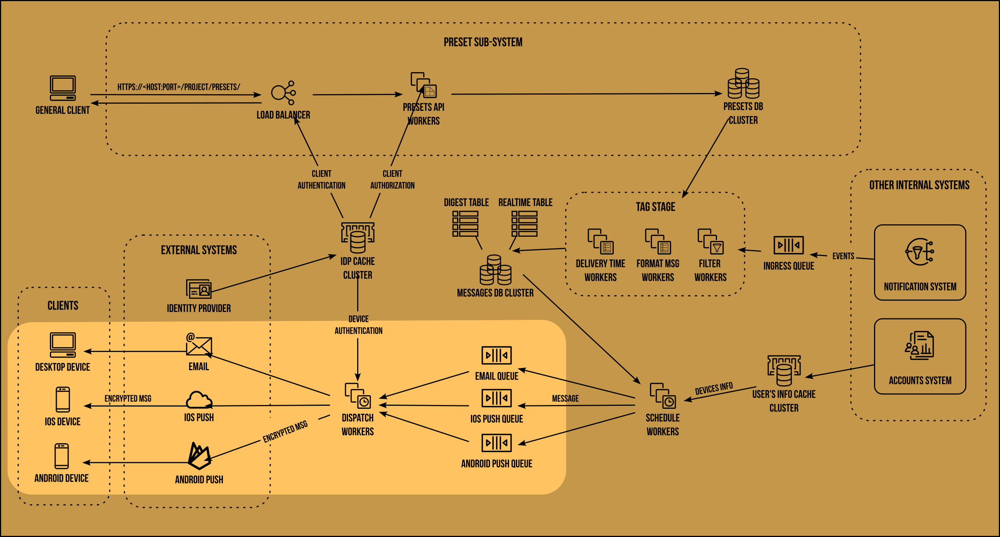

# NOTIFICATION SUBSCRIPTION SYSTEM DESIGN

## INTRODUCTION

Subscription system will be responsible for sending out notifications to the subscribed users/clients.

User can customize notifications:
- When to receive notifications [End of the Day, now or Start of the Day].
- Digest or individual messages.
- Email or push notifications.
- Subscription to a sub set of notifications based on event types, field value etc.


## DESIGN

Core part of the solution is to reliably send notifications to the users using third-party provider while respecting the user’s preferences defined in presets.


At a high level subscription system has three stages:

- **Process and tag stage** : This is the first stage that will consume the events generated from the notification system. In this stage we will     filter out incoming events based on defined presets and convert the filtered events into messages by attaching recipients to it. Format the message into a human readable format and finally tag it with the metadata required for subscription system.
- **Scheduling Stage** : In this stage we schedule the generated based on the time of the delivery if the delivery mode is realtime then we try     to schedule is as soon as possible otherwise we wait for a message’s delivery time to reached and schedule it then. We also classify messages into email or push notifications.
- **Dispatching Stage:** Once the message is scheduled for delivery we avail dispatchers to send the notification messages to the external providers which sends the notifications to the clients on our behalf.

### PRESET SUB-SYSTEM
Preset sub system enable users to export and import notification presets to personalize notifications. Moreover, events coming for notification system are filtered and categorized based on presets.


#### PERSISTENCE STORE
We will going to use a redis document store to persists presets. Data will be of the form: <scope> mapped to <preset>. Where scope is the

context a preset is defined in, for instance,
| **Scope** | **Preset Customization** |
|:---:|:---:|
|_Event:Role:Team:User_ | _preset_ |
| VersionsCreated:All:All:Default | {message_format: individual, delivery_medium: email, subscribers: [Ryan, Raphael, Brian, Anurag] } |
| VersionsCreated:All:All:Ryan | {     message_format: digest,     schedule_delivery: EOD,     delivery_medium: email } |

Here,
- First part of the scope denotes the event type
- Second part denotes the role/domain/area.
- Third one is the notification preset for a team.
- Last part denotes the user’s preset customization or the default preset.

In the above example, all the VersionsCreated events will get send to Ryan, Raphael, Brian and Anurag. Raphael, Brian and Anurag will receive real-time emails and Ryan will receive a digest as a push notification and as an email at the end of the day.

#### REQEUST FLOW

We opted for a REST api through a secure connection to perform CRUD operations on the preset database. A basic request may look like
```
GET /presets/1 {
    event_type: VersionsCreated,
    role: All,
    team: All,
    preset: default,
    message_format: individual,
    notification_types: [email],
    subscribers: [Ryan, Raphael, Brian, Anurag]
}
```
```
POST /presets/
body:
    {
        event_type: VersionsCreated,
        role: All,
        team: All,
        preset: default,
        message_format: individual,
        notification_types: [email],
        subscribers: [Ryan, Raphael, Brian, Anurag]
    }
```
```
DELETE /presets/1
```
```
PUT /presets/1
```

#### SECURITY
- **Secure connection**: All the communication between client and the preset sub-system will happen over a secured HTTP connection.
- **Authentication**: For user/client authentication we will use an external SSO and IDP service like Okta to provide authentication at the frontend level.
- **Caching**: For faster turnarounds we can locally cache the results from the external IDP provider. This will also give a bit boost to the security as it will reduce the external/remote trips.
- **Authorization**: At the application gateway level we will check the authorization of the client for the operation it needs to perform and the resource it needs to access. For instance, may be an artist/developer can read the presets but not allowed to update or delete the default preset.

#### REDUNDANCY
- We will run redis database as a cluster so that we have multiple copies of the data, in case of a failure , the requests load will be served by the other nodes until the dead node comes online.

#### PERFORMANCE

- At first glance, the search query appears to be a full table scan (O(N) complexity). However, we rely on redis’s smart indexing and cluster sharding to enhance performance that meets the expectations.

## EVENTS PROCESSING
Once the notification system has generated the event of a certain type, it gets stored in the ingress queue for subscription system to consume.


#### PROCESS AND TAG STAGE
This is the initial stage of the subscription system. End goal of this stage is to convert an event into a message by tagging the event with the single subscriber and delivery timestamp. This stage is divided into three components:
- **Filtering sub-stage (filter workers)** : In this sub-stage we matches existing presets to the incoming events and try to pair each subscriber to the match event to create a message/notification. Let’s assume we have the following preset definitions.

| **Scope** | **Preset Customization** |
|:---:|:---:|
|_Event:Role:Team:User_ | _preset_ |
| VersionsCreated:All:All:Default | {message_format: individual, delivery_medium: email, subscribers: [Ryan, Raphael, Brian, Anurag] } |
| VersionsCreated:All:All:Ryan | {     message_format: digest,     schedule_delivery: EOD,     delivery_medium: email } |

And let’s assume the incoming event is
```
{
    event_id: 12345,
    event_type: VersionCreated,
    assigned_user: Ryan,
    creation_time: 02-08-2023 14:13:11,
    ...
    ...
}
```

This event of type VersionCreated will match the first two presets (`VersionCreated:*`) and will generate 4 individual messages(number of subscribers in the default preset) with a structure of `<Event> + <recipient>` like below,
```
{
    event_id: 12345, ...
    message_id: 2,
    recipient: Ryan
}
```
```
{
    event_id: 12345, ...
    message_id: 2,
    recipient: Raphael
}
```
```
{
    event_id: 12345, ...
    message_id: 3,
    recipient: Brian
}
```
```
{
    event_id: 12345, ...
    message_id: 4,
    recipient: Anurag
}
```
And these messages get passed on to:
- **Formatting sub-Stage (Format Msg Workers)** : In this stage we will format the message into human readable format with the help of the a predefined template. Template could be `{assigned_user} has created a {version_number} version of {asset} at {creation_time}`. The output message of this sub-stage would be,
```
{
    event_id: 12345, ...
    message_id: 2, ...
    body: Ryan has created a 3.0.0 version of LukeSkywalker at 02-08-2023 14:13:11.,
    subject: A new version has been created
}
```
- **Delivery Labels sub-Stage** : This is the final sub-stage we will add the delivery timestamp based on the schedule and delivery media types to all the generated messages based on the previously matched presets. In our case, except Ryan all other three will receive realtime messages as emails based on the Default preset and Ryan will receive a digest at the end of the day (because `message_format: digest` and `schedule_delivery: EOD`) using customized preset.
```
{ ..., recipient: Ryan, message_format: digest,
       delivery_time: 02-08-2023 04:58:00
}
```
```
{ ..., recipient: Raphael, message_format: realtime,
       delivery_time: 02-08-2023 14:13:55
}
```
```
{ ..., recipient: Brian, message_format: relatime, 
       delivery_time: 02-08-2023 14:13:57
```
```
{ ..., recipient: Anurag, message_format: relatime,
       delivery_time: 02-08-2023 14:14:03
}
```
finally, all the above generated messages will get saved into the messages database.

#### MESSAGES DATABASE
Is divided into two tables:
- **Realtime messages table**: these are the messages that system makes best effort to deliver immediately.
- **Digest messages**: these are the messages that are delivered as digest and scheduled for a particular time of the day.

Holds all the rendered messages which are individual and can be delivered independently. In addition to the actual message, it hold a
TTL for a week, retries count and delivery time for the message.
| **Message [ json/bson ]** | **Time To Live [TTL in Seconds]** | **Retries Count [int]** | **Delivery Time** |
|:---:|:---:|:---:|---|
| { message_id: 1, ...} | 604800 | 0 | 02-08-2023 04:58:00 |
TTL will make sure all the messages are ephemeral and will be delete after a week even if they are undelivered and our database size remain consistent and in bounds.

#### SCHEDULING MESSAGES STAGE


Storing messages as individual units make scheduler’s job straightforward.

- **For realtime notifications**: Scheduler workers have to treat the messages database as the **priority queue** based on timestamps, order the messages by `delivery_time` and fetch all the messages whose delivery_time has passed. To avoid the full table scan, keep a pointer at the last scheduled event id and delivery timestamp and fetch the messages latest from that point.
- **For digest notifications** : the logic is a bit more involved, digest scheduler will pick up the first message and extract the recipient and `delivery_medium`. If the `schedule_delivery` is `EOD`(end of the day) then collect all the recipient’s messages whose events are generated today, and if the `schedule_delivery: BOD` (beginning of the day) then collect all the yesterday’s messages for the recipient. Create a digest from them post the message. Squash all the individual messages and replace them with above created digest message in the message database.

```
{   event_id: 12345, ..., message_id: 2, ...,
    body: Ryan has created a 3.0.0 version of LukeSkywalker at 02-08-2023 14:13:11.,
    subject: A new version has been created
}
```
```
{   event_id: 12345, ..., message_id: 3, ...,
    body: Brian has created a 4.0.0 version of Luke at 02-08-2023 15:13:11.,
subject: A new version has been created
}
```
both the above messages will get sqashed to
```
{ ..., message_id: 100, ...,
    body: Ryan has created a 3.0.0 version of LukeSkyWalker at 02-08-2023 14:13:11. Brian has created a 4.0.0 version
of LukeSkywalker at 02-08-2023 15:13:11.,
    subject: A new version has been created
}
```
- Once above steps are done, fetch the device’s information or recipient’s email address from User Account System and attach that information to the message.

Finally, enqueue them based on delivery_medium value, in our case that would be email queue.

#### DISPATCH STAGE



After the messages have been scheduled, they get picked by the dispatcher workers which first authenticate the device and email from identity provider and then send the encrypted message to the 3rd party email and push notification provider like FCM which in turn delivers the message as notification to the user’s device.

### PERFORMANCE

- **Caching:** we cache user information and identity provider results.
- **On-demand scheduler workers:** digest notifications are sent around a specific time of the day therefore, we can start digest specific schedule workers to gain performance and stop them once the work has completed.
- **TTL on each message:** if the message is delivered with finite number of retires then we can take off that message of the messages database however, if the message remain undelivered the message will automatically be deleted when TTL is up.
